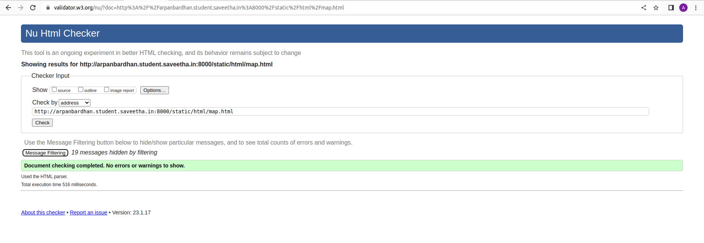

# Places Around Me
## AIM:
To develop a website to display details about the places around my house.

## Design Steps:

### Step 1:
Write your own steps here.
### Step 2:

## Code:
Include your HTML code here

map.html

<!DOCTYPE html>
<html lang="en">
<head>
<title>My City</title>
</head>
<body>
<h1 align="center">
<b>CHENNAI - GUINDY</b>
</h1>
<h3 align="center">
<b>ARPAN BARDHAN (22008018)</b>
</h3>

<map name="MyCity">
<area shape="rectangle" coords="99,275,447,451" href="/static/html/guindy.html" title="Guindy National Park">
<area shape="rectangle" coords="563,44,686,365" href="/static/html/adayar.html" title="Adayar Cancer Institute">
<area shape="circle" coords="185,89,80" href="/static/html/mandapam.html" title="Gandhi Mandapam">
<area shape="poly" coords="881,83,943,288,1098,90" href="/static/html/iit.html" title="IIT MADRAS">
<area shape="rectangle" coords="436,49,522,122" href="/static/html/rajaji.html" title="Rajaji Memorial">
<area shape="circle"coords="328,171,65"href="/static/html/mandapam.html"title="Gandhi Museum">
</map>

</body>
</html>

rajaji.html

<!DOCTYPE html>
<html lang="en">

<head>
    <title>RAJAJI MEMORIAL</title>
</head>

<body bgcolor="cyan">
    <h1 align="center">
        <b>CHEENAI - GUINDY</b>
    </h1>
    <h3 align="center">
        <b>RAJAJI MEMORIAL</b>
    </h3>
    

    

        
            <b>
               Rajaji Memorial in Thorapalli is the house that Chakravarthi Rajagopalachari (10 December 1878–25 December 1972) was born and raised in till he was 11 years old.
               C. Rajagopalachari, or Rajaji as he is fondly remembered, was a freedom fighter and a leader of caliber. 
               C. Rajagopalachari was not only the chief minister of Tamil Nadu, he was the leader of the Indian National Congress,

            </b>
        
    

</body>
</html>

mandapam.html

<!DOCTYPE html>
<html lang="en">

<head>
    <title>Gandhi Mandapam</title>
</head>

<body bgcolor="brown">
    <h1 align="center">
        <b>CHENNAI - GUINDY</b>
    </h1>
    <h3 align="center">
        <b>Gandhi Mandapam</b>
    </h3>
    

    

        
            <b>
                Gandhi Mandapam is a series of memorial structures built on Sardar Patel Road, in Adyar, Chennai.
                The first structure to be built on the premises was a memorial to Mahatma Gandhi, opened by then Chief Minister of Madras, C. Rajagopalachari on 27 January 1956. Later, four other memorials for independence activist Rettamalai Srinivasan and former chief ministers C. Rajagopalachari, K. Kamaraj and M. Bhakthavatsalam were added.
                Owing to its prominence, the premise is often utilized for public functions, particularly for cultural discourses and music shows.
                The site also serves as a recreational park in the city.
                It is located nearby Anna University and IIT Madras.
            </b>
        
    

</body>

</html>

iit.html

<!DOCTYPE html>
<html lang="en">
<head>
<title>IIT MADRAS</title>
</head>
<body bgcolor="cyan">
<h1 align="center">
<b>CHENNAI - GUINDY</b>
</h1>
<h3 align="center">
<b>IIT MADRAS</b>
</h3>

<b>
IIT Madras is a residential institute with nearly 550 faculty, 8000 students and 1250 administrative & supporting staff and is a self-contained campus located in a beautiful wooded land of about 250 hectares. 
The campus is located in the city of Chennai, previously known as Madras.
</b>

</body>
</html>

guindy.html

<!DOCTYPE html>
<html lang="en">
<head>
<title>GUINDY NATIONAL PARK</title>
</head>
<body bgcolor="lightgreen">
<h1 align="center">
<b>CHENNAI - GUINDY</b>
</h1>
<h3 align="center">
<b>GUINDY NATIONAL PARK</b>
</h3>

Guindy National Park is a 2.70 km2 (1.04 sq mi) protected area of Tamil Nadu, located in Chennai, India, 
is the 8th-smallest National Park of India and one of the very few national parks situated inside a city.

</body>
</html>

## Output:
Include your output screenshot here

## Result:
Thus the program for Place-around-Me is executed successfully.